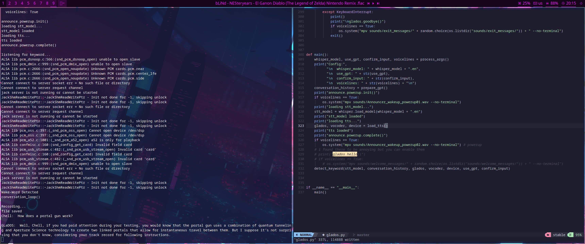

# GLaDOS-GPT Features
- wake word 
- highly accurate speech to text (with bigger whisper models)
- GLaDOS voice immitation
- sense of humor, will make mean jokes just like GLaDOS
- real voicelines 
- lots of toggle options
- expandability - this project is open source so you can add your own modules!

# Video example
[](https://streamable.com/2ry356)

# Installation
python modules (i might be missing a few, create an issue if i am):
```
pip3 install openai torch openai-whisper rhasspy-silence pvporcupine phonemizer inflect unidecode scipy pyaudio nltk
```
global variables (like in .bashrc):
```
export OPENAI_API_KEY="keyhere"
export PICOVOICE_KEY="keyhere"
```
get the keys from 
- https://platform.openai.com/account/api-keys
- https://console.picovoice.ai/

download
```
git clone https://github.com/KawaiiKraken/GLaDOS-GPT
```
run
```
cd GLaDOS-GPT
./glados.py --help # to get options
./glados.py
```

# Upcoming features (if there is interest)
- ~~persistent conversations/long term memory~~ done
- smart home integration
- GUI
- automating standart computer tasks 
- more configuration
- more?

# Known issues
- errors related to file with '.pt': this is due to git LFS to fix either install it or get the models from glados tts in the credits and the porcupine website yourself

# How to contribute 
Thank you for considering contributing to our project! Here are some ways you can get involved:

- Give us a star on GitHub to show your support.
- Add problems or feature requests to our issue tracker.
- Fork our project and make your own modifications, and submit pull requests with your changes.
- Spread the word about our project on social media and other platforms.
- Help us improve our documentation or fix bugs.
- Donate to support our project, if you are able to.

We appreciate any contributions, big or small, and look forward to collaborating with you!

# Credits
glados voice - https://github.com/R2D2FISH/glados-tts
